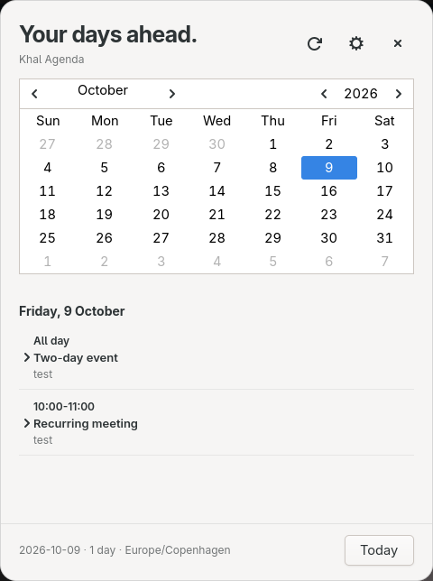
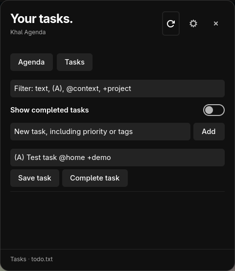

# Khal Agenda

An on-demand Wayland calendar popup for khal. Run `khal-agenda`, read the next few
days, and click outside or press Escape to close it. The process exits when the
popup closes. No tray, daemon, polling, sync service, or autostart entry.

The UI uses Rust, GTK4, and gtk4-layer-shell. It supports Wayland compositors
with the layer-shell protocol. Events are grouped by day; click an event to
expand its description and location.

Settings offers calendar toggles, GTK/light/dark themes, days ahead (0–90), and
an optional month calendar. Today is always included, so “7 days ahead” shows
eight dates. Selecting a date in the month calendar starts the agenda there;
Today resets it. Refresh rereads the synced files.



## Install

Install Rust 1.92+, GTK4, gtk4-layer-shell, Python 3, and khal. On Arch:

```sh
sudo pacman -S rust base-devel gtk4 gtk4-layer-shell python khal
cargo build --release --locked
make install
```

`make install` defaults to `~/.local`; ensure `~/.local/bin` is on your PATH.
For a system install, use `sudo make install PREFIX=/usr/local`.

The Python interpreter must be able to import khal. The backend has been tested
with khal 0.14.1. It uses khal's collection and recurrence APIs, so future khal
API changes may require a backend update. Python and khal are runtime
dependencies, not bundled in the binary.

On Arch, the prebuilt release is also available as
[`khal-agenda-bin`](https://aur.archlinux.org/packages/khal-agenda-bin):

```sh
paru -S khal-agenda-bin
```

## Release downloads

[GitHub releases](https://github.com/mikkelrask/khal-agenda/releases) provide
Linux x86_64 archives and SHA256 checksums. Install GTK4, Python 3, and khal
first, then extract the archive into `~/.local` (or `/usr/local` for a system
install). The archive includes gtk4-layer-shell and its license. GitHub builds
require glibc 2.39 or newer and GTK4 4.8 or newer; build from source on older
systems. Ensure `~/.local/bin` is on your PATH.

Version tags matching Cargo.toml, such as `v0.1.0`, run the checks, build the
archive, and publish a release only after the checks succeed. Main builds also
provide downloadable workflow artifacts. The sibling `../khal-agenda-bin`
repository maintains the AUR package: after each release finishes successfully,
pin its published archive checksum, update the version and `.SRCINFO`, run a
clean `makepkg` build, and push the package update to AUR.

## Calendars

Use your existing khal configuration. If `khal list today` works, the popup
uses the same calendars, timezone, time format, and khal cache. vdirsyncer remains
responsible for syncing `~/calendars`; the app does not edit or sync events.
Recurrences appear on each relevant day, and multi-day events appear on each day
they overlap. Calendar toggle selections are saved separately from khal.

## Open from a panel or keyboard shortcut

In Waybar's existing clock module, add:

```json
"on-click": "khal-agenda"
```

For a keyboard shortcut, bind `khal-agenda` in your compositor's configuration.
The app runs only when invoked, and repeated launches reuse the open popup.
The graphical environment and session bus must be present.

## todo.txt tasks



Enable **Tasks** in Settings and choose your todo.txt file with **Browse**, or
enter a path and click **Apply path**. The default is
`~/Documents/todo/todo.txt`. Tasks are optional and disabled by default.
The normal launch still opens the agenda. Open tasks directly with:

```sh
khal-agenda --tasks
```

This also works when the popup is already open, and can be combined with
`--focused`. The flag exposes Tasks for that invocation without changing the
saved enable toggle.

Add tasks, edit their full todo.txt lines, mark them complete, or reopen them.
Completion adds `x` and today's date; reopening removes that completion prefix.
Priorities, creation dates, `@contexts`, `+projects`, and other metadata stay in
the text. Completed tasks remain in the same file and are hidden by default;
use **Show completed tasks** to view them. Enter text in the filter and press
Enter to match a priority, context, project, or any other text.

Refresh rereads the task file after changes from another device. Saves check
that the file still matches the loaded version, preserve unaffected lines and
line endings, and replace the file atomically. If the file has changed, saving
is refused and the input stays visible so you can copy it before refreshing.
Choose an existing UTF-8 file; the app does not sync, archive, or delete tasks.

Advanced configuration:

```toml
tasks_enabled = true
todo_file = "~/Documents/todo/todo.txt"
```

## Preferences

Settings saves to `~/.config/khal-agenda/config.toml` (or `XDG_CONFIG_HOME`).
Optional advanced settings can select another khal config or a Python virtualenv:

```toml
khal_config = "/absolute/path/to/khal/config"
python = "/absolute/path/to/venv/bin/python"
```

An empty agenda and a backend failure are shown separately. Calendar reads run
asynchronously and are cancelled when replaced or when the app closes. Reads
are bounded to 20 seconds. Only one backend process runs per app instance.

## Development

```sh
cargo fmt --check
cargo clippy --all-targets -- -D warnings
cargo test
python3 -m unittest discover -s tests
```

GitHub Actions checks the source and backend fixtures on Ubuntu 24.04.

Backend fixtures cover recurring events, local timezone conversion, exclusive
all-day end dates, zero days ahead, and excluding every calendar. Use a real
Wayland session to verify the overlay and outside-click dismissal:

```sh
python3 scripts/live-smoke.py
```

Quit any existing instance first. The live test uses temporary settings and
synthetic calendars, and exits the popup when finished.

MIT licensed.

The **Top margin (px)** setting positions the popup below your bar. It accepts
0–500 logical pixels, applies immediately, and is saved as `top_margin` in the
app configuration. The default is 24 pixels.

`python3 scripts/tasks-smoke.py` verifies task editing, completion, reopening,
external-change protection, the settings toggle, and `--tasks` using a temporary
todo.txt. Never run live tests while another Khal Agenda instance is open.
